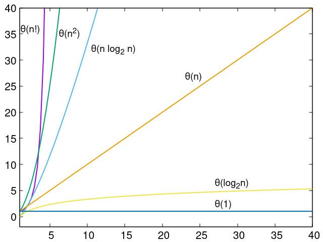
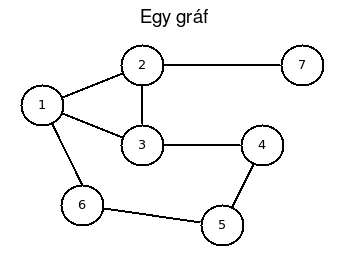
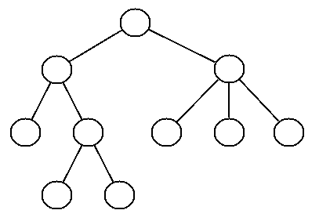
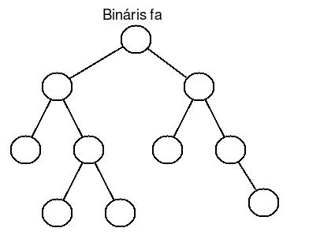
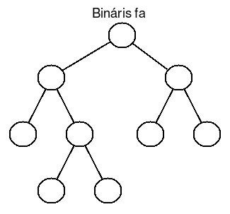

# Algoritmusok és adatszerkezetek

* **Szerző:** Sallai András
* Copyright (c) Sallai András, 2022
* Licenc: [CC Attribution-Share Alike 4.0 International](https://creativecommons.org/licenses/by-sa/4.0/)
* Web: [https://szit.hu](https://szit.hu)

## Algoritmusok bonyolultsága

### Bonyolultság

Az algorimtus bonyolultságával azt mérjük, hogy n méretű bemenet mennyi ideig tart feldolgozni. A bonyolultságot általában időben mérjük, de néha térben is elemzünk, ahol a memóriaigény az érdeklődésünk köre.

Az elméleti számítástechnika egyik ága ezzel foglalkozik, ezt nevezzük komplexitás elméletnek. Valójában az elemzések során fontosabb az algoritmus összetettségének vizsgálata, szemben az idővel.

#### Példák

Ha egy rendezetlen tömbben keresünk egy elemet, a keresési idő arányosan nő a lista méretével. Ekkor azt mondhatjuk, hogy a keresési idő lineáris.

Ha rendezett tömbben keresünk, a keresés gyorsabb lesz. Ez egy logaritmikus bonyolultság.

Ha egy tömbben az első elem a keresett érték, konstanst idő, a bonyolultság.

Keressünk egy rendezetlen listában minden ismétlődés. A bonyolultság ekkor négyzetes.

Egyetlen elem bonyolultáságnak ellenőrzése lineáris bonyolultásgú.

#### A bonyolultságok jelölése

A számításiigényt θ jelöli. Az időt O betűvel jelöljük.



Néhány algorimtus bonyoltsága a legrosszabb esetben:

* beszúró rendezés Θ(n2)
* buborék rendezés Θ(n2)
* gyors rendezés Θ(n2)
* shell-rendezés Θ(n log2 n) - függ a használt sorozattól
* összefésülő rendezés Θ(n log n)

A legrosszabb eset jelölőit látjuk a következő ábrán:


A bemenetet tengelyét 1000-re növeltem, amin látszik, hogy a legrosszabb esetet a faktoriális mutatja be.

### Tömb

Öt egész szám tárolására alkalmas tömb:

```java
int[] szamok = new int[5];
a[0] = 35;
a[1] = 22;
a[2] = 72;
a[3] = 14;
a[4] = 28;
```

```java
int[] szamok = {35, 22, 72, 14, 28};
```

```java
import java.util.ArrayList;
//...

ArrayList<Integer> szamLista = new ArrayList<>();

szamLista.add(35);
szamLista.add(22);
szamLista.add(72);
szamLista.add(14);
szamLista.add(28);
```

```java
import java.util.ArrayList;
import java.util.Arrays;
//...

Integer[] szamok = {35, 22, 72, 14, 28}
ArrayList<Integer> szamLista = new ArrayList<>(Arrays.asList(b));

//bejárás:
for(Integer szam : szamLista) {
    System.out.println(szam);
}
```

```java
import java.util.LinkedList;
//...

LinkedList<Integer> szamLista = new LinkedList<>();

szamLista.add(35);
szamLista.add(22);
szamLista.add(72);
szamLista.add(14);
szamLista.add(28);
```

Teljeskód:

```java
import java.util.LinkedList;

public class App {
    public static void main(String[] args) throws Exception {
        System.out.println("LinkedList használata");

        LinkedList<Integer> szamLista = new LinkedList<>();
        szamLista.add(35);
        szamLista.add(22);
        szamLista.add(72);
        szamLista.add(14);
        szamLista.add(28);
        for(Integer szam : szamLista) {
            System.out.println(szam);
        }
    }
}
```

### Lista műveletek

Bejárás:

```java
for(Integer szam : szamokLista) {
    System.out.println(szam);
}
```

Tartalmazás:

```java
boolean tartalmaz = szamokLista.contains(5);
```

Elem index alapján:

```java
Integer szam = szamokLista.get(2);
```

Index keresése:

```java
int index = szamokLista.indexOf(5);
```

Visszaadja milyen indexnél található a keresett elem. Ha az elem nincs a listában, akkor -1 értéket kapjuk.

Törlés index alapján:

```java
Integer szam = szamok.remove(0);
```

Törli az adott indexű elemet, majd visszatér az elemmel.

### Elemi adatszerkezetek

#### Verem


#### Sor


#### Láncolt lista


#### Fák

A gráfok olyan pontok halmaza, amelyeket vonalakkal kötünk össze.



A fa egy speciális gráf. Fa adatszerkezetben a bejárás gyorsabb, szemben a listákkal.

A gráfelmélet alapján a fák meghatározása:

* körmentes (két elem között csak egyetlen út létezik)
* összefüggő egyszerű gráfok

Fa esetén létezik egy kiemelt csomópont, a gyökérelem.




A bináris fák, sepecilis fák, mivel minden elemnek legfeljebb két gyermekeleme lehet.





### Hashmap

A HashMap kulcs-értékpárok tárolására alkalmas lista.

```java
import java.util.HashMap;
import java.util.Map;
import java.util.Set;
import java.util.Iterator;
class Program03
{
    public static void main(String args[])
    {
        HashMap<String, String> m = new HashMap<String, String>();
        m.put("alma", "apple");
        m.put("asztal", "table");
        m.put("szék", "chair");
 
        System.out.println(m.get("asztal"));
 
        System.out.println(m.containsKey("alma"));
        System.out.println(m.containsValue("apple"));
 
        Set<Map.Entry<String, String>> h = m.entrySet();
        System.out.println("------------------");        
        Iterator<Map.Entry<String, String>> i = h.iterator();
        while(i.hasNext())
        {
            Map.Entry<String, String> elem = i.next();
            System.out.println("Kulcs: "+elem.getKey()+
                "\térték: "+ elem.getValue());
        }
        System.out.println("------------------");
 
        System.out.println("------------------");        
        for (Map.Entry<String, String> entry : m.entrySet())
        {
            System.out.println(entry.getKey() + "\t" + entry.getValue());
        }
        System.out.println("------------------");
 
        String magyar = m.get("alma");
        System.out.println("Az alma jelentése: " + magyar);
 
        Set h2 = m.keySet();
        System.out.println("Van-e alma: " + h2.contains("alma"));
 
        String s = m.remove("asztal");
        System.out.println("Töröleve ez: " + s); //Eredmény: table
 
        m.clear();
        System.out.println(m.size());
    }
}
```

### Nevezetes algoritmusok

#### Buborék rendezés

* [https://szit.hu/doku.php?id=oktatas:programozas:programozasi_tetelek:mondatszeru_leiras#buborekrendezes](https://szit.hu/doku.php?id=oktatas:programozas:programozasi_tetelek:mondatszeru_leiras#buborekrendezes)

#### Rendezés beszúrással

* [https://szit.hu/doku.php?id=oktatas:programozas:programozasi_tetelek:mondatszeru_leiras#rendezes_beszurassal](https://szit.hu/doku.php?id=oktatas:programozas:programozasi_tetelek:mondatszeru_leiras#rendezes_beszurassal)

#### Gyorsrendezés

* [https://szit.hu/doku.php?id=oktatas:programozas:programozasi_tetelek:mondatszeru_leiras#gyorsrendezes](https://szit.hu/doku.php?id=oktatas:programozas:programozasi_tetelek:mondatszeru_leiras#gyorsrendezes)

#### Bináris keresés

* [https://szit.hu/doku.php?id=oktatas:programozas:programozasi_tetelek:mondatszeru_leiras#binaris_logaritmikus_vagy_felezeses_kereses](https://szit.hu/doku.php?id=oktatas:programozas:programozasi_tetelek:mondatszeru_leiras#binaris_logaritmikus_vagy_felezeses_kereses)

### Rekurzió

* [https://szit.hu/doku.php?id=oktatas:programozas:java:java_megoldasok#rekurzio](https://szit.hu/doku.php?id=oktatas:programozas:java:java_megoldasok#rekurzio)

* [https://szit.hu/doku.php?id=oktatas:programozas:programozas_elmelet:tananyag#rekurzio](https://szit.hu/doku.php?id=oktatas:programozas:programozas_elmelet:tananyag#rekurzio)
