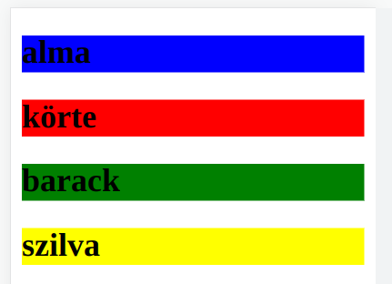
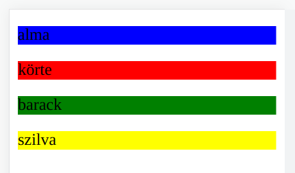
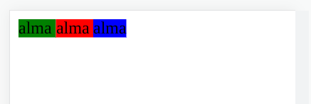

# Webszerkesztés

* **Szerző:** Sallai András
* Copyright (c) Sallai András, 2022
* Licenc: [CC Attribution-Share Alike 4.0 International](https://creativecommons.org/licenses/by-sa/4.0/)
* Web: [https://szit.hu](https://szit.hu)

## HTML

A HTML a Hypertext Markup Language rövidítése. Magyarul: Hiperszöveg jelölő nyelv. A hiperszöveg, olyan szöveg, ahol ugrásokat végehetünk egy szöveg egyik részéből egy másik részbe.

A HTML fájlokat .html kiterjesztésű állományba írjuk.

## Online szerkesztő

* [https://jsbin.com/](https://jsbin.com/)

## Telepíthető szerkesztő

* [https://code.visualstudio.com/](https://code.visualstudio.com/)

Telepítés Chocolatey csomagkezelővel:

```cmd
choco install vscode.install
```

## Helló Világ

```html
<!DOCTYPE html>
<html lang="hu">
<head>
    <meta charset="utf-8">
    <title>Cím</title>
</head>
<body>
    <h1>Az oldal címe</h1>

</body>
</html>
```

## Elemzés

Minden HTML fájlt DOCTYPE sorral kezdjük. Ez megmondja
a böngészőnek, hogy a HTML melyik verzióját használjuk.
A példában szereplő DOCTYPE-sor, azt jelenti, HTML5
verziót használunk.

A HTML oldal szerkezetét tagekkel határozzuk meg.
Egy tag kisebbmint jellel kezdődik és nagyobbmint jellel
záródik:

```xml
<név>
```

A kisebbmint és nagyobbmint jelek között adjuk meg a tag nevét.
Kétféle tag van:

* nyitó
* záró

A tartalmat ezek tagek fogják közre. Egy nyitó és egy záró taget
együtt elemenk nevezünk, HTML elem.

A weboldalak ilyen szervezése az SGML, majd később ebből kialakult
XML dokumentumleírónyelvből jött létre.

A HTML elemek lehetséges neveit szabvány határozza meg.

Az egész HTML dokumentumot html elemek közzé tesszük, a DOCTYPE sor
után.

A HTML dokumentumot két részre lehet osztani a html elemek
között:

* fejrész
* törzsrész

A fejrészt a head elemek között adjuk meg, a törzsrészt a body elemek között.

A fejrészben van két minimálisan megadandó HTML elem. Az egyik a weblap
karakterkódolását mondja meg, a másik a weboldalnak egy olyan címét határozza
meg, amely a böngésző címsorában, vagy annak fülein jelenik meg.

A karakterkódolást a meta elemmel adjuk meg. Minden HTML elem
felvehet attribútumokat. Az attribútumoknak van mindig egy értékük.
A meta elemmel nagyon sok dolog beállítható, a karakterkódolás csak
az egyik dolog. Hogy a karakterkódolást állítjuk azt a charset attribútummal
mondjuk meg. Ennek értéke adj a kódolást:

```html
<meta charset="utf-8">
```

Az értéket mindig az attribútum és egy egyenlőség jel után adjuk meg,
idézőjelek között.

A head elemek között az oldal címét a title taggel adjuk meg.

```html
<title>Valami</title>
```

## A body elem

A body elemek közzé írt tartalom jelenik meg a weboldalon.
Korábbi HTML verzióknál használtak attribútumokat a weboldal
formázására, de a HTML5 esetén a formázást CSS nyelvvel
véggezzük.

A body elemen belül újabb HTML elemeket helyezünk el a
weboldal így egy hierachikus dokumentumfába szerveződik.
Ezt a dokumentumfát nevezzük DOM-nak, ami a Document
Object Model rövidítése.

```html
<body>
    <div>
       <h1>Fejrész</h1>
       <p>Bekezdés</p>
    </div>
</body>
```

## Megjegyzés

Megjegyzéseket a következő módon készíthetünk:

```html
<!-- szöveg -->
```

A HTML megjegyzések nem ágyazhatók egymásba.

## Fejezetcímek

A fejezet címek a h1, h2, h3, h4, h5, h6 elemekkel határozhatók meg.
Alapértelmezetten a h1 elem adja a legmagasabb betűtípust.

```html
<h1>H1 fejezetcím</h1>
<h2>H2 fejezetcím</h2>
<h3>H3 fejezetcím</h3>
<h4>H4 fejezetcím</h4>
<h5>H5 fejezetcím</h5>
<h6>H6 fejezetcím</h6>
```

## Bekezdések

A szövegeket bekezdésekre szokás tagolni. A HTML nyelven a
bekezdést a "b" elemmel készíthető:

```html
<p>
Lorem ipsum dolor sit amet.
</p>
```

A contenteditable attribútummal szerkeszhető bekezdés hozható létre.

```html
<p contenteditable="true">
Lorem ipsum
</p>
```

## Általános elemek

A div és a span elemeknek nincs szemantikai jelentésük. A div elem az oldal szerkezetének meghatározására lett létrehozva. A span elem segítségével a szöveg egyes részei eltérően formázhatók.

```html
<div class="container">
    <div class="fejresz">
        <!-- ide jön a fejrész -->
    </div>
    <div class="menu">
        <!-- ide jön a menü -->
    </div>
    <div class="tartalom">
        <!-- ide jön az oldal tartalma -->
    </div>
</div>
```

## Blokk és inline szintű elemek

### Blokk elemek

Ha egy blokkelemet hozunk létre, az a tartalomtól függetlenül kitölti az a rendelkezésre álló helyet. A követkeő példban a div elemmel hozunk létre egy dobozt, amelynek a tartalma az "alma" szót. Minden HTML elem egy úgynevezett dobozt hoz létre a weblapon. Ezen dobozok mérete, kiterjedése, általában nem látszik.

```html
<body>
   <div>
       alma
   </div>
</body>
```

A div elem a böngésző bal szélétől a jobb széléig tart.

Hogy lássuk a div boboz kiterjedését, adjunk háttérszint a doboznak:

```html
<body>
   <div style="background-color: blue">
       alma
   </div>
</body>
```

A doboznak a style attribútummal állítottunk be kék háttérszint.


Több div elem egymás után:

```html
<body>
   <div style="background-color: green">
       alma
   </div>
   <div style="background-color: red">
       körte
   </div>
   <div style="background-color: blue">
       barack
   </div>

</body>
```


Fejezetcímek:

```html
<h2>alma</h2>
<h2>körte</h2>
<h2>barack</h2>
<h2>szilva</h2>
```



p elemek:

```html
    <p style="background-color: blue">alma</p>
    <p style="background-color: red">körte</p>
    <p style="background-color: green">barack</p>
    <p style="background-color: yellow">szilva</p>
```



Láthatjuk, hogy az blokk elemek egymás után folynak lefele a weblapon, mindegyik egyetlen sort elfoglalva.

### Inline elemek

Az inline elemek a tartalomhoz igazodnak.

```html
<body>
   <span style="background-color: blue">
       alma
   </span>
</body>
```


Több inline elem:

```html
<body>
    <span style="background-color: green">
        alma
    </span>
    <span style="background-color: red">
        alma
    </span>
    <span style="background-color: blue">
        alma
    </span>    
</body>
```

Több inline elem egysorban jelenik meg mindaddig, amíg elfér a böngészőben. Ha egy inline elem nem fér el, akkor a következő sorba jelenik meg.



Figyeljük meg, hogy a dobozok egymás után jelennek meg, egyetlen sorban. Az inline elemek körülfogják a tartalmat és nem nagyobbak mint a tartalom. Egymás után egyetlen sorban folynak, ha nincs több hely, a következő sorba folynak a weblapon.

### Összefoglaló

Egyes elemek blokk szintűek, egyes elemek inline szintűk:

Blokk elemek:

* div
* p
* h1 - h6
* stb.

Inline elemek:

* span
* b
* i
* a
* stb.

## Sortörés

Sortörést a br elemmel lehet megvalósítani. A b elemnek nincs lezáró része, a lezárást az elem neve után írt szóköz, majd a / karakter jelöli.

```html
<br />
```

## Kiemelés

A kiemelésekre többéle HTML elem áll rendelkezésre. A követkeő három fejezet, ilyen kiemelő elemeket mutat be.

### Szövegek kiemelése

| Tag | Leírás |
|-|-|
| &lt;b&gt; | félkövér szöveg |
| &lt;em&gt; | kiemelt szöveg  |
| &lt;i&gt; | dőlt szöveg |
| &lt;small&gt; | kis szöveg |
| &lt;strong&gt; | erős szöveg |
| &lt;sub&gt; | alsó index |
| &lt;sup&gt; | felő index |
| &lt;ins&gt; | beszúrt szöveg |
| &lt;del&gt; | törölt szöveg |
| &lt;s&gt; | elavult, pontatlan, nem fontos szöveg |

### Számítógépes kiemelések

| Tag | Leírás |
|-|-|
| &lt;code&gt; | számítógépes kód |
| &lt;kbd&gt; | billentyűzet |
| &lt;samp&gt; | mintakód |
| &lt;var&gt; | változó |
| &lt;pre&gt; | előreformázott szöveg |

### Idézetek és definíciók

| Tag | Leírás |
|-|-|
| &lt;abbr&gt; | egy rövidítés |
| &lt;address&gt; | cím |
| &lt;bdo&gt; | szöveg iránya |
| &lt;blockquote&gt; | hosszú idézet |
| &lt;q&gt; | rövid idézet |
| &lt;cite&gt; | cím idézése |
| &lt;dfn&gt; | egy kifejezése meghatározása |

## Listák

A listák minden dokumentumban fontos szervező elemek. A HTML oldalakon háromféle listát hozhatunk létre:

* számozott
* számozatlan
* definíciós

A számozott és számozatlan lista egymásba átalakítható a később tanulásra kerülő CSS segítségével.

### Számozatlan lista

```html
<ul>
    <li>alma</li>
    <li>körte</li>
    <li>barack</li>
    <li>szilva</li>
</ul>
```

### Számozott lista

```html
<ol>
    <li>alma</li>
    <li>körte</li>
    <li>barack</li>
    <li>szilva</li>
</ol>
```

A számozás szabályozása:

```html
<ol start="40">
    <li>alma</li>
    <li>körte</li>
    <li>barack</li>
    <li>szilva</li>
</ol>
```

A számozás megfordítása:

```html
<ol reversed="reversed">
    <li>alma</li>
    <li>körte</li>
    <li>barack</li>
    <li>szilva</li>
</ol>
```

### Egymásbaágyazás

```html
<ol>
  <li>Olaszorzság</li>
  <li>Magyarország
    <ol>
      <li>Hatvan</li>
      <li>Szolnok</li>
      <li>Miskolc</li>
    </ol>
  </li>
  <li>Szlovákia</li>
</ol>
```

### Definíciós lista

```html
<dl>
  <dt>fogalom</dt>
    <dd>leírás</dd>
  <dt>fogalom2</dt>
    <dd>leírás</dd>
    <dd>alternatív leírás</dd>
    <dd>másik alternatív leírás</dd>
</dl>
```

## Képek beillesztése

Használható típusok:

* .jpg
* .gif
* .png

```html

```

Az src és az alt attribútumok kötelezőek.

A képeknek, azonban más attribútumai is lehetnek.

```html

```

### A figure elem

A figure elem segítésgével összefoghatjuk a képet és a feliratát.

```html
<figure>
  
  <figcaption>Felirat<figcaption>
</figure>
```

## Táblázat

A táblázat elterjedt formája többféle tulajdonság megjelenítésének.

### Alap

```html
<table border="1">
  <tr>
    <th>#</th>
    <th>Név</th>
  </tr>
  <tr>
    <td>1</td>
    <td>Pala Béla</td>
  </tr>
</table>
```

A border attribútumot szegélyt határoz meg a táblázat részére. Ezt nem így fogjuk megadni később, de most jól látható ettől a táblázat kinézete.

### Táblázat felirata

A caption elem segítségével feliratozható a táblázat. Böngészőtől függ, hogy ez hol jelenik meg.

```html
<table border="1">
  <caption>Dolgozók</caption>
  <tr>
    <th>#</th>
    <th>Név</th>
  </tr>
  <tr>
    <td>1</td>
    <td>Pala Béla</td>
  </tr>
</table>
```

### Táblázat összefoglalója

Ritkábban használt attribútum a summary, amiben megadhatunk egy összefoglalót, ami egyébként csak a forráskódban jelenik meg.

```html
<table border="1" summary="A dolgozók adatai">
  <caption>Dolgozók</caption>
  <tr>
    <th>#</th>
    <th>Név</th>
  </tr>
  <tr>
    <td>1</td>
    <td>Pala Béla</td>
  </tr>
</table>
```

### Cellanyúlás

```html
<table border="1">
  <tr>
    <th colspan="2">Költségek</th>
  </tr>
  <tr>
    <th>Hónap</th>
    <th>Spórolás</th>
  </tr>
  <tr>
    <td>Január</td>
    <td>1000 Ft</td>
  </tr>
</table>
```

### Sornyúlás

```html
<table border="1">
  <tr>
    <th rowspan="2">Adatok</th>
    <th>Hónap</th>
    <th>Spórolás</th>
  </tr>
  <tr>
    <td>Január</td>
    <td>1000 Ft</td>
  </tr>
</table>
```

### Sor- és cellanyúlás

```html
<table border="1">
  <tr>
    <th rowspan="3">Adatok</th>
    <th colspan="2">Költségek</th>
  </tr>
  <tr>
    <th>Hónap</th>
    <th>Spórolás</th>
  </tr>
  <tr>
    <td>Január</td>
    <td>1000 Ft</td>
  </tr>
</table>
```

### Táblázat részeinek csoportosítása

```html
<table>
  <thead>
    <tr>
      <th>Név</th>
      <th>Fizetés</th>
    </tr>
  </thead>
  <tbody>
    <tr>
      <td>Nagy János</td>
      <td>3850000</td>
    </tr>
    <tr>
      <td>Kemény Ferenc</td>
      <td>2870000</td>
    </tr>
  </tbody>
  <tfoot>
    <tr>
      <td>Összesen</td>
      <td>6720000</td>
    </tr>
  </tfoot>
</table>
```

### Oszlopok csoportosítása

```html
<table>
  <colgroup>
    <col span="2" style="background-color:yellow">
    <col style="background-color:blue">
  </colgroup>
  <tr>
    <th>No.</th>
    <th>Név</th>
    <th>Település</th>
  </tr>
  <tr>
    <td>1</td>
    <td>Nagy József</td>
    <td>Szolnok</td>
  </tr>
  <tr>
    <td>2</td>
    <td>Peres Ferenc</td>
    <td>Szeged</td>
  </tr>
</table>
```

## Hiperhivatkozás

```html
<a href="hivatkozas">Leírás</a>
```

A hivatkozás lehet egy horgony, lehet egy másik weblap, vagy egy másik weblap horgonnyal.

```html
<a href="#horgonynev">Leírás</a>
<a href="masik.html">Leírás</a>
<a href="masik.html#horgonynev">Leírás</a>
```

Ha egy weboldalon belül szeretnénk egy szöveghez ugrani, akkor ahova szeretnénk ugrani, ott lenni kell egy horgonynak.

Horgony:

```html
<a id="név"></a>
```

vagy:

```html
<a name="név"></a>
```

## Videó

```html
<video src="fajlnev.ogg" width=”300” height=”300”></video>
```

```html
<video  width=”300” height=”300”>
    <source src="fajlnev1.ogg">
    <source src="fajlnev2.mp4">
</video>
```

## Hang

```html
<audio controls="controls">
  <source src="hangfajl.ogg" type="audio/ogg">
  <source src="hangfajl.mp3" type="audio/mpeg">
A böngésződ nem támogatja az audio elemet. 
</audio>
```

## Űrlap

Az űrlapok segítségével a weblap felhasználója adatokat közölhet a webszerverrel.

```html
<form action="akcio.php" method="POST">
<fieldset>
  <legend>Teljesnév</legend>
  <label for="vnev">Vezetéknév:</label>
  <input type="text" name="vnev" value="" id="vnev" /><br />
  <label for="knev">Keresztnév:</lable>
  <input type="text" name="knev" value="" id="knev" /><br />
 
  <input type="submit" value="Elküld" />
</fieldset>
 
</form>
```

## Az oldal szerkezetét leíró elemek

Az oldal szerkezetét általános célú div elemekkel,
vagy szemantikus elemekkel írjuk le. Erre a célra
a következő szemantikus elemek állnak rendelkezésre:

* section - a weblap egy szakasza
* aside - érintőlegesen kapcsolódó tartalom
* header - az oldal vagy egy rész fejrésze
* nav - navigációs sáv
* footer - az odal vagy egy rész lábrésze
* article - tartalmi egységek
* main - az oldal főbb része

## Gyakorlat

### Szerkesztő gyakorlat

Oldjon meg feladatokat a következő gyűjteményből:

* [https://szit.hu/doku.php?id=oktatas:web:html:html_feladatok](https://szit.hu/doku.php?id=oktatas:web:html:html_feladatok)

### Feleletválasztós gyakoralt

1.) Melyik HTML elem a gyökérelem egy dokumentumban?

* head
* doctype
* html
* body

2.) Melyik HTML elemmel adjuk meg lang változót?

* head
* html
* body
* div

3.) Melyik az a HTML elem, amelynek a tartalma a böngészőben megjelenik mint weblap?

* head
* meta
* title
* body

4.) Mit állíthatunk be a lang attribútummal?

* Az oldal készítésének dátuma.
* A weboldal karakterkódolása.
* A weboldal nyelvezete.
* A weboldalhoz használt fordító program.

5.) Melyik a helyes karakterkódolás beállítás?

* &lt;html charset="utf-8"&gt;
* &lt;lang charset="utf-8"&gt;
* &lt;body charset="utf-8"&gt;
* &lt;meta charset="utf-8"&gt;

6.) Ha szeretnénk megjeleníteni a "Madár" szót elsődleges fejezetcímként, akkor azt a következő elemek között tesszük.

* body
* head
* title
* lang

7.) &lt;html lang="hu"&gt;&lt;/html&gt; részletből HTML elemnek nevezzük a következőt:

* lang
* bármelyik html egyedül
* a két html együtt
* "hu"

8.) Egy HTML elem egyik tagját így hívjuk:

* log
* tag
* feg
* heg

9.) A title elemek célja:

* A weblapon megjelenő oldal címének beállítása.
* A weblap karakterkódolásának beállítása.
* A weblap címe a böngésző fülön vagy a címsorában.
* A weblap gyökéreleme.

10.) A body elem célja:

* A böngészőfülön cím beállítása.
* A weboldal kódolásának beállítása.
* A weboldalon megjelenő tartalmat ide helyezzük.
* A weboldal nyelvét állítjuk be.

11.) HTML oldalon a helyes megjegyzés:

* /&lowast; szöveg &lowast;/
* &lt;!-- szöveg --&gt;
* &num; szöveg
* { szöveg }

12.) Ennyi féle fejezetcím állítható be a HTML elemekkel:

* 4
* 5
* 6
* 7

13.) Kettes szintű fejezetcímet a következő HTML elemmel állítunk be:

* h2
* f2
* head2
* header2

14.) HTML-en belül bekezdésnek a következő elemmel jelölünk szöveget:

* a
* b
* p
* i

15.) Melyik elem általános célú a következők közül.

* i
* h1
* div
* em

16.) Melyik elem általános célú a következők közül.

* i
* span
* p
* pre

17.) Mitől blokkszintű egy HTML elem?

* A tartalma csak utf-8 kódolású lehet.
* Csak a tartalmat fogja körbe.
* Nem lehet tartalma.
* Kitölti a rendelkezésre álló helyet.

18.) Mit inline egy HTML elem?

* Kitölti a rendelkezésre álló helyet.
* Nem lehet tartalma.
* Csak a tartalmat fogja körbe.
* A tartalma csak utf-8 kódolású lehet.

19.) Melyik blokk elem?

* span
* i
* b
* div

20.) Melyik inline elem?

* i
* div
* p
* h1

21.) Hogyan lehet sortörést megjeleníteni a weblapon?

* line
* br
* break
* linebreak
