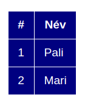
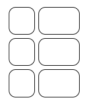

# Webprogramozás - CSS

* **Szerző:** Sallai András
* Copyright (c) Sallai András, 2022
* Licenc: [CC Attribution-Share Alike 4.0 International](https://creativecommons.org/licenses/by-sa/4.0/)
* Web: [https://szit.hu](https://szit.hu)

## Stíluslapok eredete

Stíluslap származhat szerzőtől, felhasználótól és böngészőtől:

* Szerzői - Webmester írja
* Felhasználói - A böngészőben beállítható saját CSS
* Klines - böngészőnek is van saját stílusa

## CSS - táblázatok

```css
.table_001 {
   border: 1px solid black;
   border-collapse: collapse;
}
.table_001 tr td{
   border: 1px solid black;
   padding: 10px;
}
```

A collapse hatására a táblázat
cellái között megszűnik az üres hely.

Legyen egy táblázat:

```html
<table>
  <tr>
     <th>#</th>
     <th>Név</th>
  </tr>
  <tr>
     <td>1</td>
     <td>Pali</td>
  </tr>
  <tr>
     <td>2</td>
     <td>Mari</td>
  </tr>
</table>
```

```css
.table {
  border: 1px solid white;
}
.table th, .table td{
  border: 1px solid white;
  background-color: navy;
  color: white;
}
```



### Lekerekített táblaszegélyek

```html
<table class="table">
  <tr>
     <th>#</th>
     <th>Név</th>
  </tr>
  <tr>
     <td>1</td>
     <td>Pali</td>
  </tr>
  <tr>
     <td>2</td>
     <td>Mari</td>
  </tr>
</table>
```

```css
.table {
  border-collapse: separate;
  border-spacing: 5px;
}
.table th, .table td{
  border: 1px solid black;
  background-color: nav;
  color: white;
  border-radius: 10px;
}
```



### Táblázat méretezése

```html
<table class="table">
  <tr>
     <th>#</th>
     <th style="width:70%">Név</th>
     <th>Település</th>
  </tr>
  <tr>
     <td>1</td>
     <td>Pali</td>
     <td>Szeged</td>
  </tr>
  <tr>
     <td>2</td>
     <td>Mari</td>
     <td>Szolnok</td>
  </tr>
</table>
```

```css
.table {
  border-collapse: collapse;
  width: 100%;
}
.table th, .table td{
  border: 1px solid black;

}
```


## nth-child

A nth-child ál-osztály lehetővé teszi
ismétlődő elemek esetén adott számú
elem külön formázását.

```html
<table>
  <tr>
    <td>termék1</td>
    <td>termék2</td>
  </tr>
  <tr>
    <td>termék1</td>
    <td>termék2</td>
  </tr>
  <tr>
    <td>termék1</td>
    <td>termék2</td>
  </tr>
  <tr>
    <td>termék1</td>
    <td>termék2</td>
  </tr>
</table>
```

```css
tr:nth-child(3) {
    background-color: orange;
}
```

Több információ az nth-child állosztlyról:

* [https://szit.hu/doku.php?id=oktatas:web:css:css_szelektorok#az_nth-child_al-osztaly](https://szit.hu/doku.php?id=oktatas:web:css:css_szelektorok#az_nth-child_al-osztaly)

## media query

```css
/* A szöveg alapértelmezett színe */
body {
  background-color: blue;
}
 
/* 900px vagy kisebb kijelző esetén */
@media screen and (max-width: 900px) {
  body {
    background-color: green;
  }
}
 
/* Képernyőn és 700px vagy annál kisebb kijelzőn */
@media screen and (max-width: 700px) {
  body {
    background-color: yellow;
  }
}
```

## Színek

A színek az RGB színtér használatával vagy nevekkel adhatók meg.

Szín névvel:

```css
p {
    background-color: olive;
}
```

Szín RGB kóddal, hexadecimálisan:

```css
p {
    background-color: #8080000;
}
```

Szín RGB kóddal, decimálisan:

```css
p {
    background-color: rgb(128, 128, 0);
}
```

```css
p {
    background-color: rgba(128, 128, 0, 1);
}
```

Rövidítés:

```css
p {
    background-color: #333;
}
```

Egyenértékű ezzel:

```css
p {
    background-color: #333333;
}
```

## Átlátszatlanság

Beállítás egy doboz számára:

```css
.doboz {
    opacity: 0.6;
}
```

Beállítás a doboz háttérszínének:

```css
.doboz {
   background-color:rgba(255, 0, 0, 0.3);
} 
```

Több információ:

* [https://szit.hu/doku.php?id=oktatas:web:css:css_nyelv#atlatszatlansag](https://szit.hu/doku.php?id=oktatas:web:css:css_nyelv#atlatszatlansag)

## Színátmenet

```css
.doboz {
  background-image: linear-gradient(navy, blue);
}
```

A színátmenetekről bővebben:

* [https://szit.hu/doku.php?id=oktatas:web:css:css3#szinatmenet](https://szit.hu/doku.php?id=oktatas:web:css:css3#szinatmenet)

## Dobozok árnyékolása

```css
.egy {
  box-shadow: 15px 15px 15px black;
}
```

## Körvonal

A körvonal olyan vonal, amelyet a doboz köré
húzunk, a szegélyen kívül. Egy elem
kiemelésére használható.

A következő tulajdonságok használhatók:

* outline-style
* outline-color
* outline-width
* outline-width
* outline-offset - milyen távol jelenjen meg
* outline

A körvonal az elemeken kívül rajzolódik,
így átfedhet más tartalmakat. A körvonal nem
része az elem méreteinek sem.

## Szöveg árnyék

```css
.egy {
  text-shadow: 5px 5px 5px black;
}
```

## Szegély lekerekítése

```css
.egy {
  border-radius: 15px;
}
```

## >, +, ~ szelektorok

* div > p
  * p elem, aminek szülője egy div
* div + p
  * az első p elem a div után
* div ~ p
  * az összes p elem, amit megelőz egy div

## Attribútum szelektorok

```html
<a>a elem</div>
<a target="_blank">a elem</div>
```

```css
a[target] {
    background-color: blueviolet;
}
```

## Előtte és utána

::before ::after

```html
<div class="egy">Első</div>
<div class="ketto">Második</div>
<div class="harom">Harmadik</div>
```

```css
.egy::before {
    content: "előtte";
    background-color: blueviolet;
}
```

```css
.egy::after {
    content: "utána";
    background-color: blueviolet;
}
```

## Flex doboz

```html
<div class="burkolo">
 
    <div class="egy">
        Lorem ipsum dolor sit amet.
    </div>
    <div class="egy">
        Lorem ipsum dolor sit amet.
    </div>
    <div class="egy">
        Lorem ipsum dolor sit amet.
    </div>
 
</div>
```

```css
.burkolo {
    display: flex;
}
 
.egy {
    padding: 10px;
    background-color: orange;
}
```

Több információ:

* [https://szit.hu/doku.php?id=oktatas:web:css:css_flex](https://szit.hu/doku.php?id=oktatas:web:css:css_flex)

## Grid dobozok

```html
<div class="grid">
    <div class="item">a</div>
    <div class="item">b</div>
    <div class="item">c</div>
    <div class="item">d</div>
    <div class="item">e</div>
</div>
```

```css
.grid {
    display: grid;
    grid-template-columns: 1fr 2fr;
    grid-template-rows: 50px 50px 50px;
    grid-gap: 30px;
}
 
.item {
    background-color: orange;
}
```

Az fr a Grid elrendezési lehetőséggel együtt
érkezett. Az fr a „fractional unit” rövidítése, ami töredék résznek fordítható. **1fr** a **rendelkezésre álló résznek az egyszerese**.

## CSS Animation és Transition

Az animáció:

* [https://szit.hu/doku.php?id=oktatas:web:css:css_animacio](https://szit.hu/doku.php?id=oktatas:web:css:css_animacio)

Transition:

```html
<div class="egy"></div>
```

```css
.egy {
    width: 100px;
    height: 100px;
    background-color: navy;
    transition: width 2s, height 4s;
}
 
.egy:hover {
    width: 300px;
    height: 300px;    
}
```

## Transzformációk

```css
#egy {
  background-color: navy;
  color: white;
  padding: 5px;
  position: absolute;
  top: 50px;
  transform: rotate(-90deg); 
}
```

A dobozt az óramutató járásával ellentétes
irányba fordítja 90°-kal.

További transformációk:

* [https://szit.hu/doku.php?id=oktatas:web:css:css3#transzformaciok](https://szit.hu/doku.php?id=oktatas:web:css:css3#transzformaciok)

## CSS változók

```css
:root {
  --main-bg-color: navy;
}
.valami {
  background-color: var(--main-bg-color);
}
```

## CSS preprocessor

A preprocessor egy előfeldolgozó program,
amely valamilyen szintaxis szerint írt
CSS-t lefordít a böngészők által ismert
CSS-re.

Céljuk az olvashatóbb, könnyebb
karbantartás, plusz funkciók (beágyazás,
keverés).

Az előfeldolgozó telepíthető a webszerverre
vagy webes fejlesztés során használjuk.

Néhány népszerű előfeldolgozó:

* Sass
* LESS
* Stylus
* PostCSS

## A Sass

A Sass a Syntactically Awesome Stylesheets rövidítése. A Sass egy stíluskészítő scriptnyelv, fordítóval. Előfeldolgozó nyelvnek is mondjuk.

Webhely: [https://sass-lang.com/](https://sass-lang.com/)

Más előfeldolgozó nyelvek:

* LESS
* Stylus

A Sass két szintaxissal használható:

* behúzott szintaxis
* SCSS (Sassy CSS) szintaxis

A különbség a tagolásban van. A behúzott szintaxisnál a behúzásokból ered a tagolás, míg a SCSS esetén a {} kapcsoszárójelekből.

|  Szintaxis | Kiterjesztés |
|-|-|
| behúzott | .sass |
| SCSS (Sassy CSS) | .scss |

### Fordító

A NodeJS csomagkezelőjével telepíthető a fordító:

```cmd
npm install -g sass
```

Ellenőrizzük:

```cmd
sass --version
```

### Első Sass fájl

Készítsünk egy app.scss fájlt a következő tartalommmal:

```scss
$primary-color: #333;
$background: skyblue;

body {
  color: $primary-color;
  background-color: $background;
}
```

Fordítás:

```cmd
sass app.scss app.css
```

Figyelhetjük a változásokat és a fordítás azonnal megtörténhet:

```cmd
sass --watch app.scss app.css
```

Ebben a rövid feladatban a változókat használtunk Sass nyelven.
